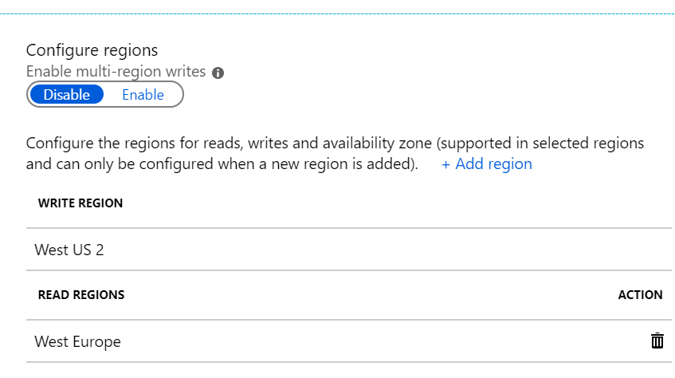

  &nbsp; Azure Cosmos DB Scalability Demo
==========================================

This Azure Cosmos DB Scalability Demo has been crafted showcasing Cosmos DB's ability to ingest records at scale whilst still providing the flexibility to be scaled back down when not required along the ability to reduce application latency by replicating data to a region closest to the application and thereby increasing application responsiveness.
The first part demonstrates the functionality provided by The Azure Cosmos DB BulkExecutor library for .NET which provides developers out-of-the-box functionality to perform bulk operations in [Azure Cosmos DB](http://cosmosdb.com) and scale the collections allocated RU/s up and down as needed.

The second part demonstrates the ability query data from an Azure Cosmos DB collection geographically co-located with the application through the use of geo-replication, thereby reducing the round trip latency of the query and in turn increasing application responsiveness.

<strong><em>Table of Contents</em></strong>

- [Setting up your environment](#Azure-Setup)
    - [Deploying your VMs](#Azure-VM-Setup)
    - [Deploying your Azure Cosmos DB account, database and container](#Azure-CosmosDB-Setup)
    - [Troubleshooting Connectivity](#Azure-NSG-Setup)
    - [Deploying the application](#Azure-App-Deployment)
    - [Scaling your collection up for Demo](#Azure-Scale)
    - [Cleaning up after your Demo](#Azure-Cleanup)
- [Performance tips](#additional-pointers)
- [Contributing & Feedback](#contributing--feedback)
- [Other relevant projects](#relevant-projects)

## Setting up your Azure environment

In order to deliver this demonstration you will need an Azure Subscription within which you will be deploying the requisite Azure Service resources, specifically an Azure Cosmos DB account, database and collection and 2 Azure Visual Studio 2019 VMs onto which we will install the demo solution.
For this demonstration you will need to choose two Azure regions, preferably with large geographical separation. For example a US and Europe or Asian region. We will be deploying a VM into each of the regions chosen and an Azure Cosmos DB collection replicated between these two chosen regions. Whist it is not important which two regions you choose, it is important to ensure that you remain consistent with deployment of the resources into these two regions throughout the setup process.
In the examples we will be using West US 2 and West Europe

First, login to the Azure portal

You will need to create a resource group of your choice contain all the resources for this demo. Whist not strictly necessary to a single resource group consistently using a single resource group will allow for speedy clean up when you finished using the demo environment.

### Creating Azure Cosmos DB account, database and container

In this step you will need to an Azure Cosmos DB account, database and container
In the Portal add a resource for an Azure Cosmos DB Account
Configure this account to use the Core (SQL) API and select the first of the two regions call this account scaledemo

 1. 

Once created open the Cosmos DB account resource and add a container.

  

Ensure that Provision database throughput is unchecked 
And that the remainder of the configuration is as follows:
•	Database id: ScaleTest
•	Container id: VehicleTest
•	Partition ket: /vin

  

Select the Throughput RU/s to be the maximum value that you want to demonstrate at. 50000 RU/s will give you opportunity to demonstrate a significant number of insert operations per second. However also not that leaving this configuration running for any extended period of time will accrue a fairly large expense to your Azure bill. 

Recommendation: reduce the RU/s back down to a lower level once the Container has been created 

### Enabling Azure Cosmos DB account global replication

Once the Container has deployed you can now configure Azure Cosmos DB global replication for the account.
Select Replicate data globally from the settings menu within the account, on the left.

Then tick the region on the map that matches the second region that you have previously chosen and click save. 
On the right-hand side of the configuration you should see a region configuration that has a write region and read region that match your two chosen regions.

### Creating Azure Virtual Machines

In this step you will need to create two Azure virtual machines (VM) based on the Visual Studio images within the Azure Marketplace. Using Visual Studio in a preconfigured Azure virtual machine (VM) is a quick, easy way to go from nothing to an up-and-running development environment without the need to install all the required software to complete this demonstration.
From the Marketplace within Azure portal select the “Visual Studio 2019 Latest” image 

and then select the Visual Studio 2019 Community Edition on Windows 10

see https://docs.microsoft.com/en-us/azure/virtual-machines/windows/using-visual-studio-vm.

When configuring the first VM select the first of the two regions you chose, and the select second region you chose when configuring the second VM.

###

### Troubleshooting Connectivity to VMs
For additional information on how to trouble shoot the most common RDP connectiviy issues see.
https://docs.microsoft.com/en-us/azure/virtual-machines/troubleshooting/troubleshoot-rdp-nsg-problem

### Deploying the solution
On both VMs open a Command Prompt and execute the following steps to create a local folder to download you application code into and clone the demo repo to the local folder.

Batchfile
    md C:\CosmosDemo
    git clone https://github.com/Azure-Samples/cosmos-scalability-demo C:\CosmosDemo

see git-clone.png

Batchfile
    cd \CosmosDemo\ScalabilityDemo
    CosmosDemo.sln
this will open the solution in Visual Studio 2019

Alternativly open File Explorer, browse to the C:\CosmosDemo\ScalabilityDemo and double click the CosmosDemo.sln wich will open the solution in Visual Studio 2019 without the need to open a command prompt to do so.

## Opening Visual Studio 2019 for the first time

You will be required to sign into the installed Visual Studio Community edition the first time you run it. 
For additional details see https://docs.microsoft.com/en-us/visualstudio/ide/signing-in-to-visual-studio?view=vs-2019

## The original sample application 
You can find the complete sample application program consuming the bulk import API [here](https://github.com/Azure/azure-cosmosdb-bulkexecutor-dotnet-getting-started/blob/master/BulkImportSample/BulkImportSample/Program.cs) - which generates random documents to be then bulk imported into an Azure Cosmos DB collection. You can configure the application settings in *appSettings* [here](https://github.com/Azure/azure-cosmosdb-bulkexecutor-dotnet-getting-started/blob/master/BulkImportSample/BulkImportSample/App.config). 

Additionaly the associated documentation will provide you with additional insight into the inner workings of the demostation code provided here.

## Microsoft.Azure.CosmosDB.BulkExecutor nuget package 
You can download the Microsoft.Azure.CosmosDB.BulkExecutor nuget package from [here](https://www.nuget.org/packages/Microsoft.Azure.CosmosDB.BulkExecutor/).

------------------------------------------
## Contributing & feedback

This project has adopted the [Microsoft Open Source Code of
Conduct](https://opensource.microsoft.com/codeofconduct/).  For more information
see the [Code of Conduct
FAQ](https://opensource.microsoft.com/codeofconduct/faq/) or contact
[opencode@microsoft.com](mailto:opencode@microsoft.com) with any additional
questions or comments.

See [CONTRIBUTING.md](CONTRIBUTING.md) for contribution guidelines.

To give feedback and/or report an issue, open a [GitHub
Issue](https://help.github.com/articles/creating-an-issue/).

------------------------------------------

## Other relevant projects

* [Cosmos DB BulkExecutor library for Java](https://github.com/Azure/azure-cosmosdb-bulkexecutor-java-getting-started)